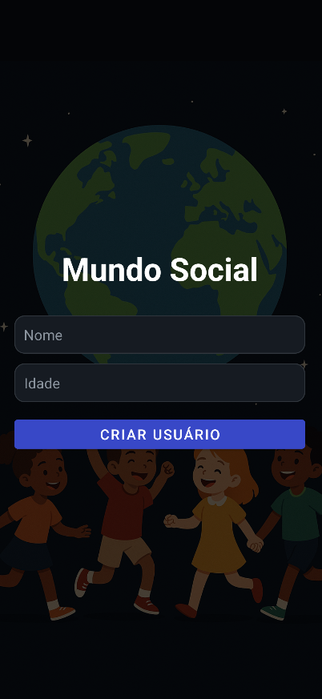
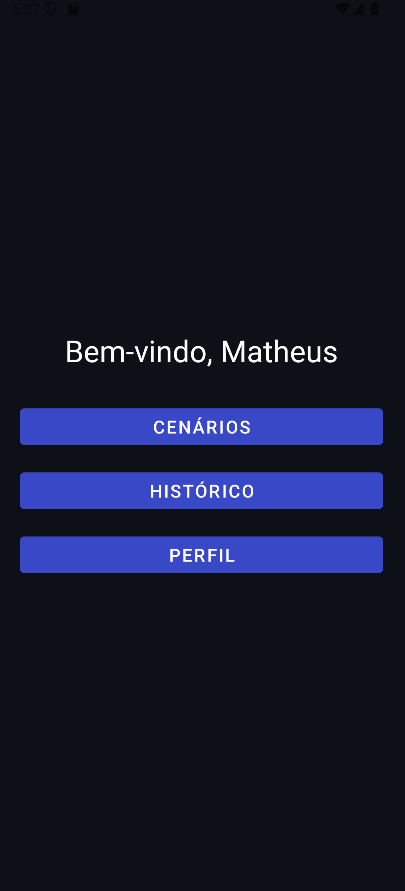
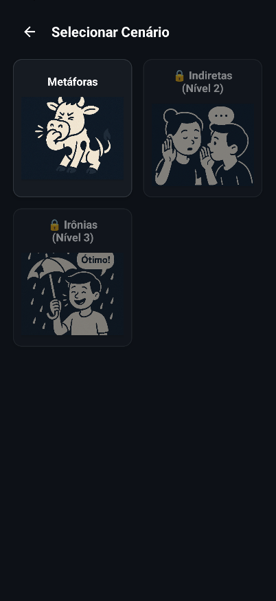
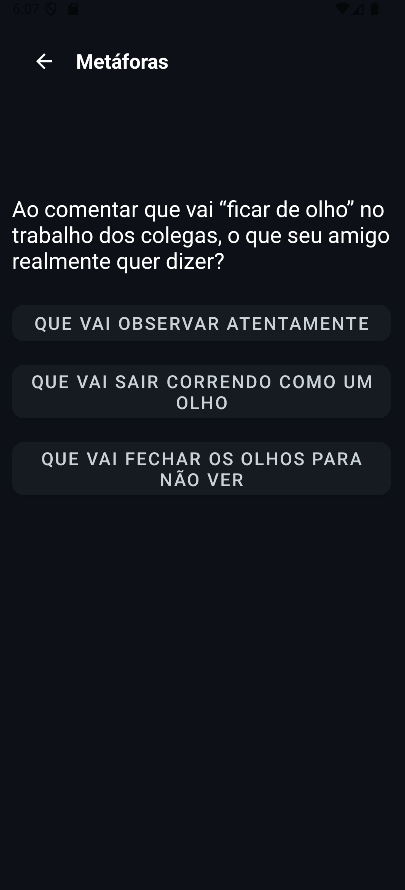
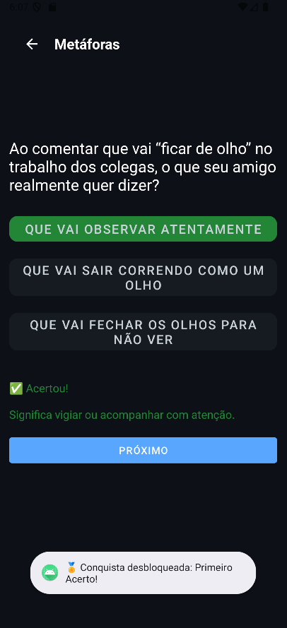
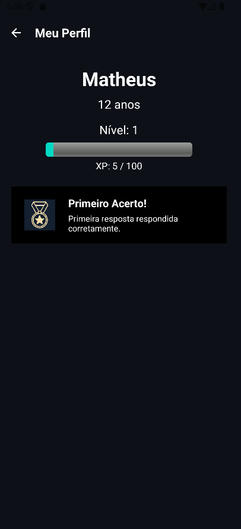
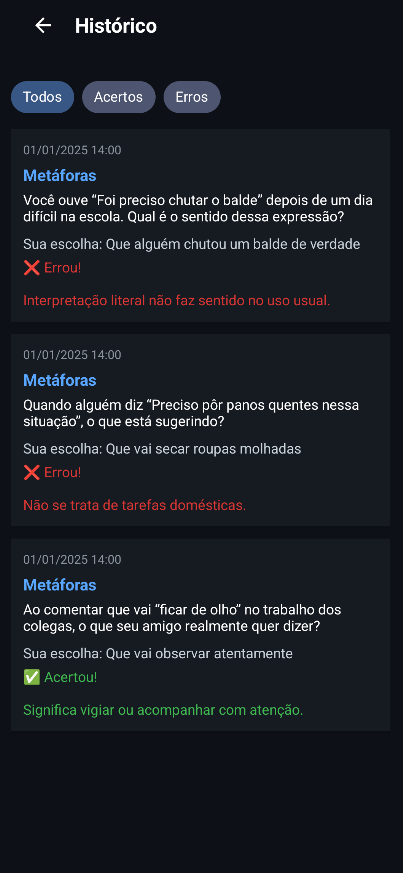

# Mundo Social

Mundo Social é um aplicativo Android **offline** para desenvolvimento socioemocional de crianças e adolescentes — incluindo jovens com TEA (Transtorno do Espectro Autista) — por meio de histórias interativas e roleplays gamificados.

## Objetivo

Hoje em dia, crianças e adolescentes — especialmente os diagnosticados com TEA — dispõem de poucos ambientes digitais seguros e adaptativos para treinar habilidades sociais. As interações cotidianas nem sempre oferecem feedback estruturado e gradual; identificar nuances de expressões e intenções pode ser um desafio.

A solução proposta é um aplicativo móvel com histórias interativas que:

- Apresentam **cenários adaptativos** com três opções de resposta.
- Utilizam **Adaptive Learning**, ajustando o nível de dificuldade com base no desempenho.
- Oferecem **feedback imediato e explicativo** após cada resposta.
- Contam com **gamificação**, recompensando o progresso com XP, medalhas e “nível social”.
- Funcionam **100% offline**, garantindo acessibilidade mesmo sem conexão.

---

## Funcionalidades Principais

- Cadastro simples de usuário (nome e idade)
- Início de cenários com histórias interativas
- Feedback contextual após cada resposta
- Ajuste de dificuldade automático (Adaptive Learning)
- Acúmulo de XP e aumento de nível social
- Tela de conquistas, histórico e estatísticas do usuário

---

## Stack Tecnológica e Ferramentas Utilizadas

### 🧠 Lógica e Aplicação
- **Linguagem de Programação**: Kotlin
- **IDE**: Android Studio
- **Plataforma-alvo**: Android (app nativo)
- **Padrões Arquiteturais**: MVVM (Model-View-ViewModel)

### 🗃️ Banco de Dados
- **SQLite**: Banco embarcado
- **Room (Jetpack)**: ORM usado para abstração do SQLite

### 🔧 Bibliotecas e APIs do Android
- **AndroidX**
- **Jetpack Components**:
  - Room
  - ViewModel
  - LiveData
  - Navigation
- **Kotlin Coroutines**: Gerenciamento de tarefas assíncronas
- **Material Design**: Componentes visuais modernos e acessíveis
- **RecyclerView**: Listagem de histórias, conquistas e histórico
- **SharedPreferences**: Armazenamento de configurações simples

### 🎨 Design e Experiência do Usuário
- Interface adaptada para crianças de 9 a 15 anos
- Fluxo intuitivo de navegação entre as telas
- Feedback visual e textual após cada interação

---

## Telas do Aplicativo

- **Criação de Usuário**

- **Dashboard**

- **Seleção de Cenário**

- **História Interativa**

- **Feedback da Resposta**

- **Tela de Conquistas**

- **Histórico de Acertos/Erros**

---

## Contribuições

Este projeto está em desenvolvimento acadêmico e focado em acessibilidade e inclusão.

---

## Licença

[MIT](LICENSE)
